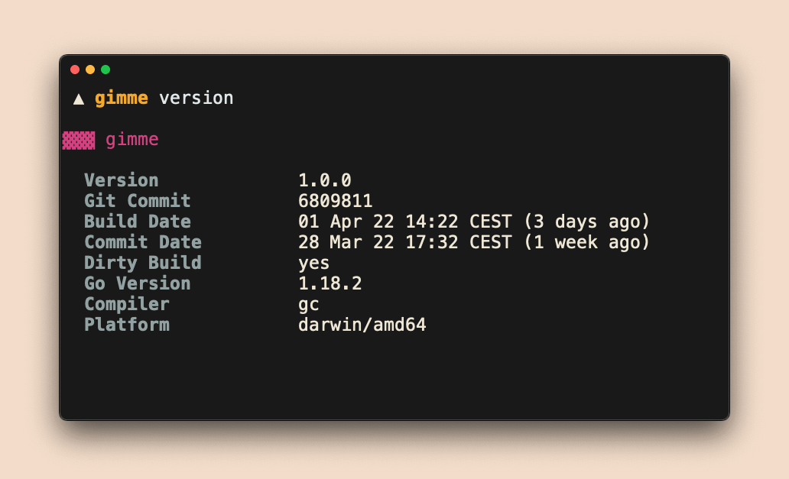

```go
import "go.szostok.io/version"
```

Go package to present your CLI version in **a classy way**. All magic included!



Like the idea? Give a GitHub star ⭐!

## Quick Start

```bash
go get go.szostok.io/version
```

Visit [`version.szostok.io/quick-start`](https://version.szostok.io/quick-start) for the most popular way of the setup.

## Documentation

Visit [`version.szostok.io`](https://version.szostok.io) for complete documentation about setup and usage.

Curious why? See the [CLI version: a collection of handy tips](https://dev.to/mszostok/cli-version-a-collection-of-handy-tips-1nce) blog post.

## Functionality

- For Go 1.18+, detect `version`, `commit`, `commitDate`, and `dirtyBuild` automatically
  - Allow version data overriding via `-ldflags`
- Print the version in the YAML, JSON, short, and pretty formats
- Detect and display an upgrade notice if a newer version of your project has been released
- Automatically disable color output for non-tty output streams
  - Handle the version and upgrade notices separately
- Designed in a way that lets you use each component individually
- Everything can be enabled with a single line of code. For example, use `extension.NewVersionCobraCmd()` to enable the version command for Cobra
- Customize the output format and behaviour (e.g. timeouts, re-check intervals)
- Parse any dates and print them in the local date and time format
- All provided functionality is fully tested to ensure no regression
- Extend the version info with own fields just by assigning your Go struct.
<!--- - Autodiscover installation method --->

##  Stay informed

Follow [@m_szostok](https://twitter.com/m_szostok) on Twitter to get the latest news. You can also subscribe for new [`version`](https://github.com/mszostok/version/releases) releases on GitHub, where you can find a detailed changelog for each of them.

For additional content, check [Mateusz Szostok's blog](https://szostok.io).
