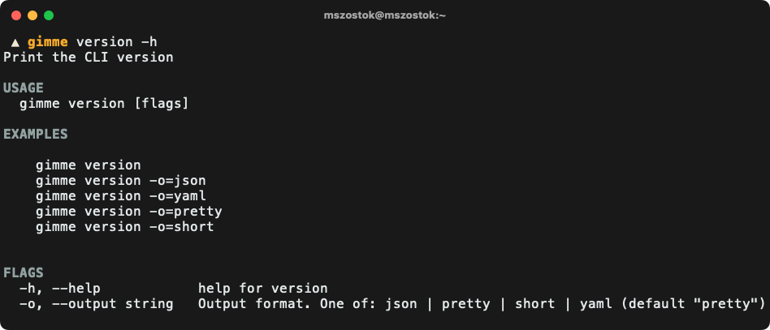

# `version`

<a href="https://twitter.com/m_szostok"></a>

Importable Go package for printing an opinionated CLI version. All magic included!

```go
import "go.szostok.io/version"
```

<p align="center">
  
</p>

<p align="center">
  <i>A pure DNA of your CLI</i>
</p>

## Usage

### Custom

```go
func foo() {
  version.CollectFromBuildInfo()

  printer := version.NewPrinter()
  printer.RegisterFlags(ver.Flags())

  printer.Print(cmd.OutOrStdout(), Get(name))
}
```
### Cobra

```go
package cmd

import (
	"log"

	"github.com/mszostok/version"
	"github.com/spf13/cobra"
)

// NewRoot returns a root cobra.Command for the whole CLI.
func NewRoot() *cobra.Command {
	rootCmd := &cobra.Command{
		Use:   "gimme",
		Short: "Insights about a Git(Hub) repository.",
		Run: func(cmd *cobra.Command, args []string) {
			if err := cmd.Help(); err != nil {
				log.Fatalln(err)
			}
		},
	}

	rootCmd.AddCommand(
		// Just register and you are done!
		version.NewCobraCmd("gimme"),
	)

	return rootCmd
}
```

In that way you get a fully working `<cli> version` command.


