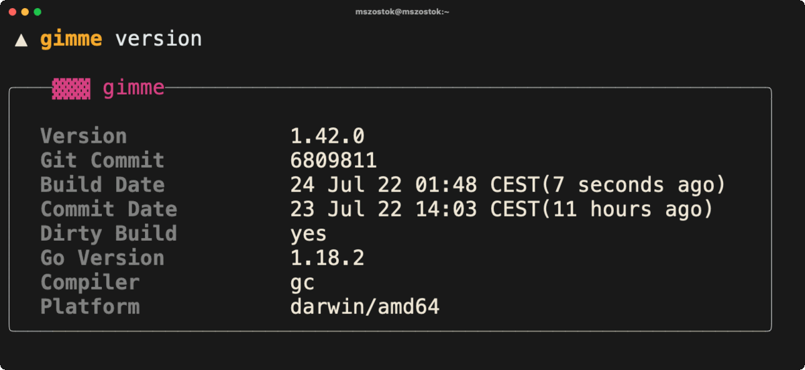
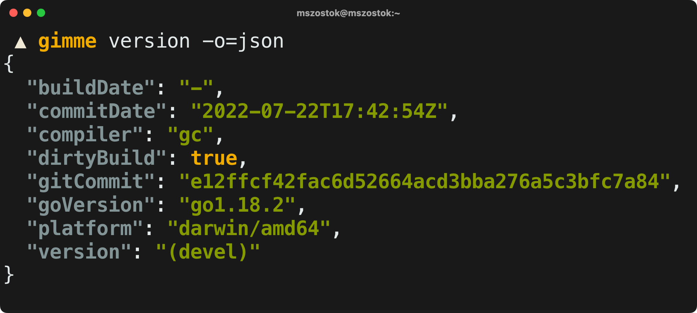
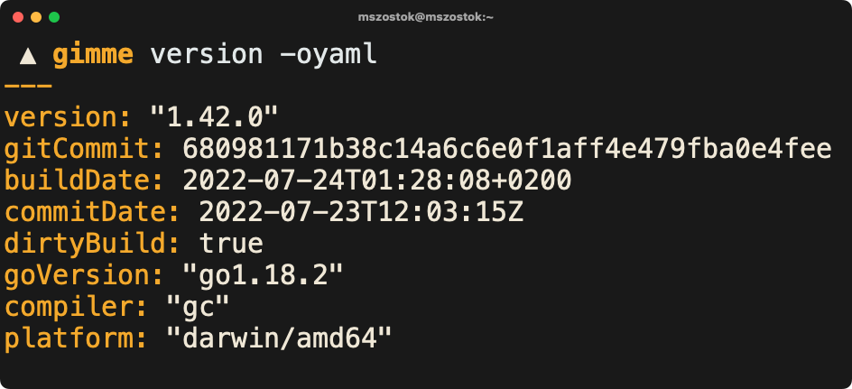
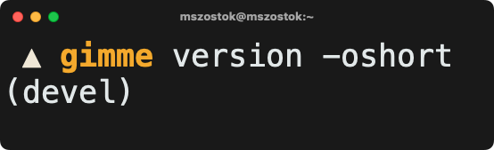

```go
import "go.szostok.io/version"
```

Importable Go package to present your CLI version in a classy way. All magic included!


Like the idea? Give a GitHub star ⭐!

## Quick Start

```bash
go get go.szostok.io/version
```

Visit the [version.szostok.io/quick-start](https://version.szostok.io/quick-start) for the most popular way of the setup.

## Documentation

<!--- Curious why? See the [blogpost about displaying the CLI version](). --->

Visit the [version.szostok.io](https://version.szostok.io) for complete documentation about setup and usage.

## Functionality

- For Go 1.18+ detect `version`, `commit`, `commitDate`, `dirtyBuild` automatically
  - Allow to override the data via `-ldflags`
- Print version in YAML, JSON, short and pretty formats
- Detect and display an upgrade notice if a newer version was released
- Automatically disable color output for non-tty output streams
  - Handle version and upgrade notice separately
- Highly customizable output format
- Parse any dates and print it in the local time
<!--- - Autodiscover installation method --->
<!--- - All provided functionality is fully tested to ensure no regression --->

<br /><br />



### `pretty` format

There are two different built-in styles. However, you can easily create your own. You can customize formatting or layout or provide own renderer.
<br /><br /> <br /><br /> <br /><br />



### `json` format

JSON format can be useful for scripting purposes, e.g.

```
<cli> version -ojson | jq .gitCommit
```

<br /><br />
<br /><br />



### `yaml` format

YAML format can be useful for scripting purposes, e.g.

```
<cli> version -oyaml | yq .gitCommit
```

<br /><br />
<br /><br />



### `short` format

Short format can be useful for CI purposes to easily validate that the correct version is used.

<br /><br />

##  Staying Informed

Follow the [@mszostok](https://twitter.com/m_szostok) on Twitter to get the latest news. You can also subscribe for new [`version`](https://github.com/mszostok/version/releases) releases on GitHub. I post there a detailed changelog for every release.

For more additional content check the [Mateusz's Szostok blog](https://szostok.io).
