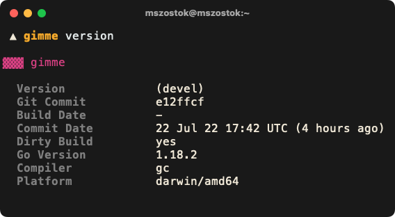
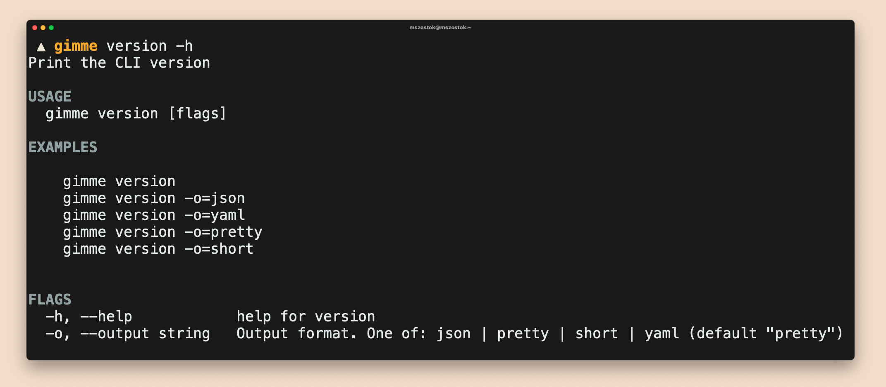

```go
import "go.szostok.io/version"
```

Importable Go package to present your CLI version in a classy way. All magic included!


Like the idea? Give a GitHub star ⭐!

## Documentation

<!--- Curious why? See the [blogpost on showing CLI version](). --->

Visit the [version.szostok.io](https://version.szostok.io) for complete documentation about setup and usage.

## Functionality

- Print version in YAML, JSON, short and pretty formats
- Parse any date strings
- Print date in the local time
- Autodiscover installation method
- Display an upgrade notice if a newer version was released
- Adaptive colors for light and dark terminal backgrounds
- Highly customizable

<br /><br />



### `pretty` format

Pretty format a.k.a human-readable.
<br /><br /> <br /><br /> <br /><br />
<br /><br /> <br /><br /> <br /><br />


### `json` format

JSON format that can be useful for CI examples, e.g.
```
<cli> version -ojson | jq .gitCommit
```

<br /><br />
<br /><br />


### `yaml` format

YAML format that can be useful for CI examples, e.g.
```
<cli> version -oyaml | yq .gitCommit
```

<br /><br />
<br /><br />


### `short` format

JSON format that can be useful for CI examples, e.g. `<cli> version -ojson | jq .gitCommit`

<br /><br />

## Get Started

### Custom [![playground][play-simple-img]][play-simple]

```go
func main() {
	version.CollectFromBuildInfo()

	info := version.Get()
	fmt.Println("Version: ", info.Version)
	fmt.Println("Git Commit: ", info.GitCommit)
	fmt.Println("Build Date: ", info.BuildDate)
	fmt.Println("Commit Date: ", info.CommitDate)
	fmt.Println("Dirty Build: ", info.DirtyBuild)
	fmt.Println("Go Version: ", info.GoVersion)
	fmt.Println("Compiler: ", info.Compiler)
	fmt.Println("Platform: ", info.Platform)
}
```

### Printer [![playground][play-simple-img]][play-simple]

```go
func main() {
  version.CollectFromBuildInfo()

  printer := version.NewPrinter()
  printer.RegisterFlags(ver.Flags())

  printer.Print(os.Stdout)
}
```

### Cobra [![playground][play-simple-img]][play-simple]

```go
package cmd

import (
	"log"

	"github.com/mszostok/version"
	"github.com/spf13/cobra"
)

// NewRoot returns a root cobra.Command for the whole CLI.
func NewRoot() *cobra.Command {
	rootCmd := &cobra.Command{
		Use:   "gimme",
		Short: "Insights about a Git(Hub) repository.",
		Run: func(cmd *cobra.Command, args []string) {
			if err := cmd.Help(); err != nil {
				log.Fatalln(err)
			}
		},
	}

	rootCmd.AddCommand(
		// Just register and you are done!
		version.NewCobraCmd(),
	)

	return rootCmd
}
```

In that way you get a fully working `<cli> version` command.



## Set versioning info with `-ldflag`

```bash
# The version common library import path
export VERSION_PKG=github.com/mszostok/version

# The ldflags for the go build process to set the version related data.
export GO_BUILD_VERSION_LDFLAGS=\
	-X $(VERSION_PKG).version=$(VERSION) \
	-X $(VERSION_PKG).dirtyBuild=false \
	-X $(VERSION_PKG).buildDate=$(shell date +"%Y%m%d-%T")
```

### Goreleaser

### Magefile

[play-simple-img]: https://img.shields.io/badge/playground-custom-29BEB0?style=flat&logo=go
[play-simple]: https://go.dev/play/p/

