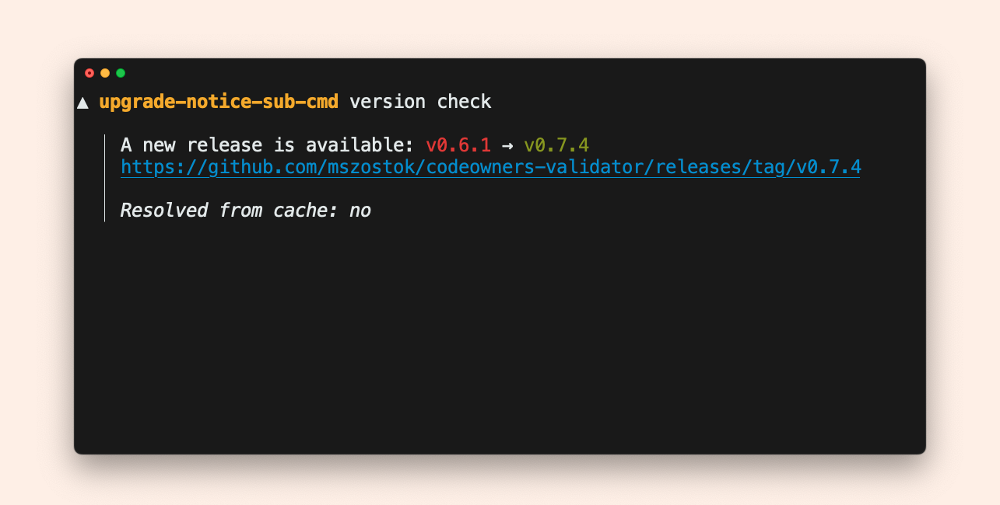

# Add `version check` sub-command

You can create a dedicated sub-command that will check if there is a new release on GitHub.

For a complete example see the [`upgrade-notice-sub-cmd`](https://github.com/mszostok/version/tree/main/example/upgrade-notice-sub-cmd/main.go)!
