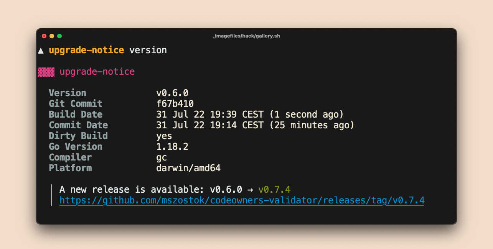

# Upgrade notice



!!! tip ""
    Currently, it works only for GitHub releases.

The upgrade notice is disabled by default. To enable, add dedicated option function to constructor:

```go
// Turn on upgrade notice
version.WithUpgradeNotice("mszostok", "codeowners-validator")
```

Once enabled, each `<cli> version` execution checks for new releases, but only once every 24 hours. If a newer version was found, displays upgrade notice for each output format on standard
error.

By printing on standard error, we ensure that, e.g. `<cli> version -ojson | jq .gitCommit` works properly even if upgrade notice is displayed.

You can customize almost all aspect of upgrade check:

- Set maximum duration time for update check operation (default 10s).

    ```go
    upgrade.WithUpdateCheckTimeout(30*time.Second)
    ```

- Set a custom function to compare release versions (default SemVer check).

    ```go
    upgrade.WithIsVersionGreater(func(current string, new string) bool {
      	//.. compare current with new ..
      	return true
    })
    ```

- Set the minimum time that must elapse before checking for a new release (default 24h).

    ```go
    upgrade.WithMinElapseTimeForRecheck(time.Second)
    ```

- Change formatting.

    ```go
    upgrade.WithFormatting(&style.Formatting{
			Header: style.Header{},
			Key:    style.Key{},
			Val:    style.Val{},
			Date:   style.Date{},
		}),
    ```

- Change [layout](./layout.md).

    ```go
    upgrade.WithLayout(&style.Layout{
    			GoTemplate: forBoxLayoutGoTpl,
    		}),
    ```

- Define [custom renderer](./custom-renderer.md).

    ```go
    upgrade.WithRenderer(func(in *upgrade.Info) (string, error) {
    	return fmt.Sprintf(`
    		Version             %q
    		New Version         %q
    		Published At        %v
    	`, in.Version, in.NewVersion, in.PublishedAt), nil
    })
    ```

- Add post render hook.

    ```go
    upgrade.WithPostRenderHook(func(body string) (string, error) {
    	return body + "\ncustom footer", nil
    }),
    ```
