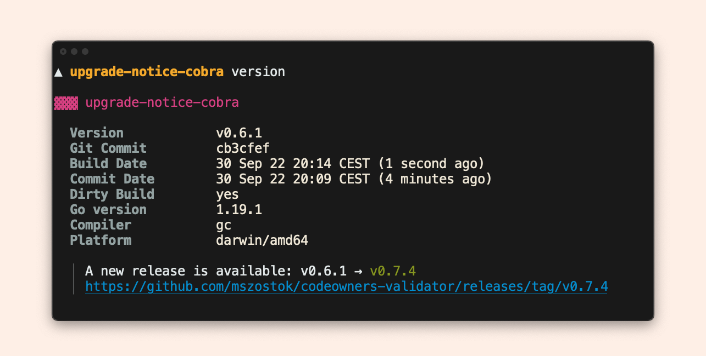

# Upgrade notice



!!! tip ""
    Currently, the upgrade notice works only for GitHub releases.

The upgrade notice is disabled by default. You can easily enable it based on your usage:

- Printer

    ```go
    p := printer.New(
        printer.WithUpgradeNotice("mszostok", "codeowners-validator", upgradeOpts...),
    )
    ```

  It prints the notice to the standard error channel ([`stderr`](https://en.wikipedia.org/wiki/Standard_streams#Standard_error_(stderr))). As a result, output processing, such as executing `<cli> -ojson | jq .gitCommit`, works properly even if the upgrade notice is displayed.

- Cobra CLI

      ```go
      extension.NewVersionCobraCmd(
          // 2. Explict turn on upgrade notice
          extension.WithUpgradeNotice("mszostok", "codeowners-validator"),
      ),
      ```
  It prints the notice on standard error channel ([`stderr`](https://en.wikipedia.org/wiki/Standard_streams#Standard_error_(stderr))). As a result, output processing, such as executing `<cli> version -ojson | jq .gitCommit`, works properly even if the upgrade notice is displayed.

- Standalone

    ```go
    notice := upgrade.NewGitHubDetector("mszostok", "codeowners-validator")
    err := notice.PrintIfFoundGreater(os.Stderr, "0.5.4")
    ```

Once enabled, each execution checks for new releases but only once every 24 hours. If a newer version has been found, it displays an upgrade notice for each output format to the standard
error channel ([`stderr`](https://en.wikipedia.org/wiki/Standard_streams#Standard_error_(stderr))).

You can customize almost all aspects of the upgrade check:

- Set maximum duration time for the update check operation (default: `10s`):

    ```go
    upgrade.WithUpdateCheckTimeout(30*time.Second)
    ```

- Set a custom function to compare release versions (default: [SemVer](https://semver.org/) check):

    ```go
    upgrade.WithIsVersionGreater(func(current string, new string) bool {
      	//.. compare current with new ..
      	return true
    })
    ```

- Set the minimum time that must elapse before checking for a new release (default: `0min`):

    ```go
    upgrade.WithMinElapseTimeForRecheck(time.Second)
    ```

- Change formatting:

    ```go
    upgrade.WithFormatting(&style.Formatting{
			Header: style.Header{},
			Key:    style.Key{},
			Val:    style.Val{},
			Date:   style.Date{},
		})
    ```

- Change [layout](./layout.md):

    ```go
    upgrade.WithLayout(&style.Layout{
    			GoTemplate: forBoxLayoutGoTpl,
    		})
    ```

- Change both formatting and [layout](./layout.md):

    ```go
    upgrade.WithStyle(&style.Config{})
    ```

- Define a [custom renderer](./custom-renderer.md):

    ```go
    upgrade.WithRenderer(func(in *upgrade.Info) (string, error) {
    	return fmt.Sprintf(`
    		Version             %q
    		New Version         %q
    	`, in.Version, in.NewVersion), nil
    })
    ```

- Add a post-render hook:

    ```go
    upgrade.WithPostRenderHook(func(body string) (string, error) {
    	return body + "\ncustom footer", nil
    })
    ```
