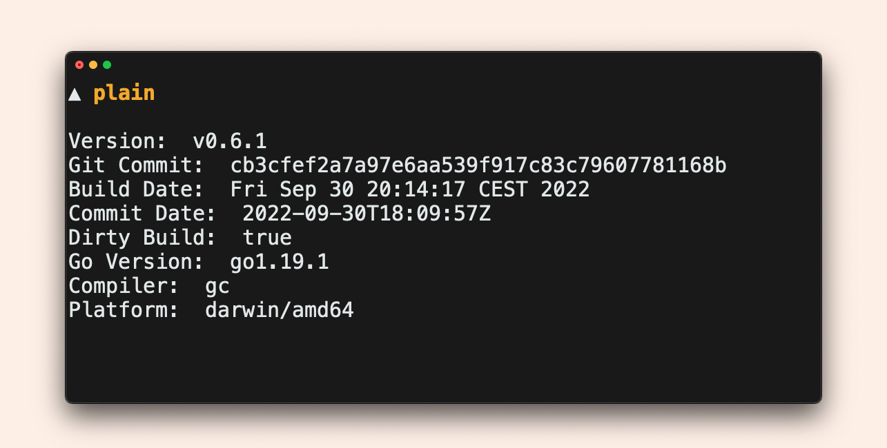
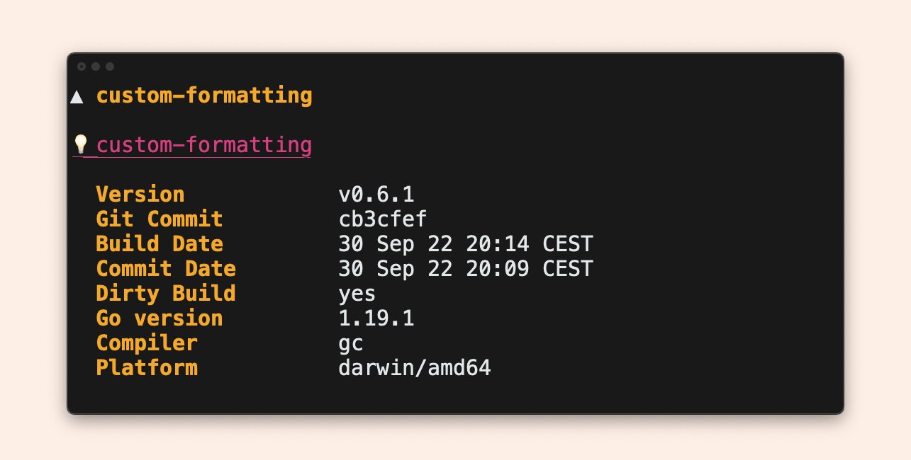
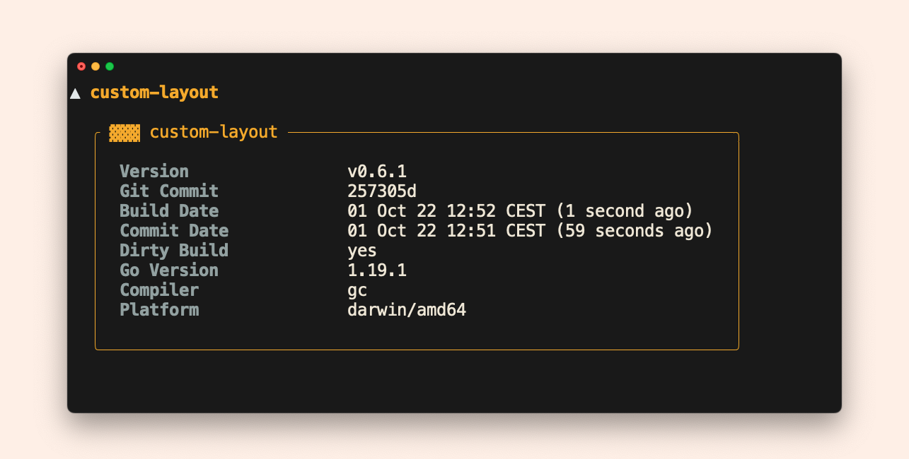
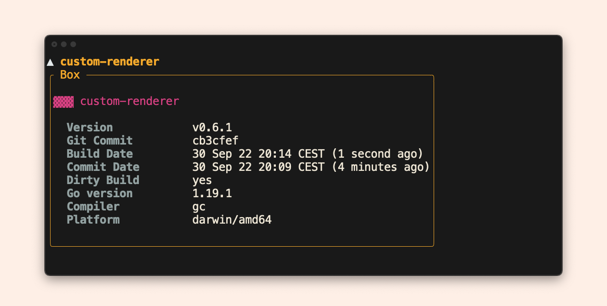

# Runnable examples

???+ example "Prerequisites"

    To play with it:

    1. Clone the repository:
    	 ```bash
    	 gh repo clone mszostok/version
    	 ```
    2. Navigate to [`example`](https://github.com/mszostok/version/tree/main/example) directory.
    3. Run a given example.


## [Cobra](https://github.com/mszostok/version/tree/main/example/cobra/main.go)


!!! run-example "Run in terminal"
    ```bash
    # Build
    go build -ldflags "-X 'go.szostok.io/version.buildDate=`date`'" -o example ./cobra

    # Showcase
    ./example version -h
    ./example version
    ```

## [Upgrade notice](https://github.com/mszostok/version/tree/main/example/upgrade-notice/main.go)


!!! run-example "Run in terminal"
    ```bash
    # Build
    go build -ldflags "-X 'go.szostok.io/version.version=0.6.0'" -o example ./upgrade-notice

    # Showcase
    ./example version
    ./example version -ojson
    ```

## [Upgrade notice (box)](https://github.com/mszostok/version/tree/main/example/upgrade-notice-box/main.go)


!!! run-example "Run in terminal"
    ```bash
    # Build
    go build -ldflags "-X 'go.szostok.io/version.version=0.6.0'" -o example ./upgrade-notice-box

    # Showcase
    ./example version
    ```

## [Printer](https://github.com/mszostok/version/tree/main/example/printer/main.go)


!!! run-example "Run in terminal"
    ```bash
    # Build
    go build -ldflags "-X 'go.szostok.io/version.buildDate=`date`'" -o example ./printer

    # Showcase
    ./example
    ./example -oyaml
    ./example version -oshort
    ```

## [Plain](https://github.com/mszostok/version/tree/main/example/plain/main.go)



!!! run-example "Run in terminal"

    ```bash
    # Build
    go build  -ldflags "-X 'go.szostok.io/version.buildDate=`date`'" -o example ./plain

    # Showcase
    ./example
    ```

## [Custom Formatting](https://github.com/mszostok/version/tree/main/example/custom-formatting/main.go)



!!! run-example "Run in terminal"
    ```bash
    # Build
    go build -ldflags "-X 'go.szostok.io/version.buildDate=`date`'" -o example ./custom-formatting

    # Showcase
    ./example
    ```

## [Custom Layout](https://github.com/mszostok/version/tree/main/example/custom-layout/main.go)



!!! run-example "Run in terminal"
    ```bash
    # Build
    go build -ldflags "-X 'go.szostok.io/version.buildDate=`date`'" -o example ./custom-layout

    # Showcase
    ./example
    ```

## [Custom Renderer](https://github.com/mszostok/version/tree/main/example/custom-renderer/main.go)



!!! run-example "Run in terminal"
    ```bash
    # Build
    go build -ldflags "-X 'go.szostok.io/version.buildDate=`date`'" -o example ./custom-renderer

    # Showcase
    ./example
    ```
