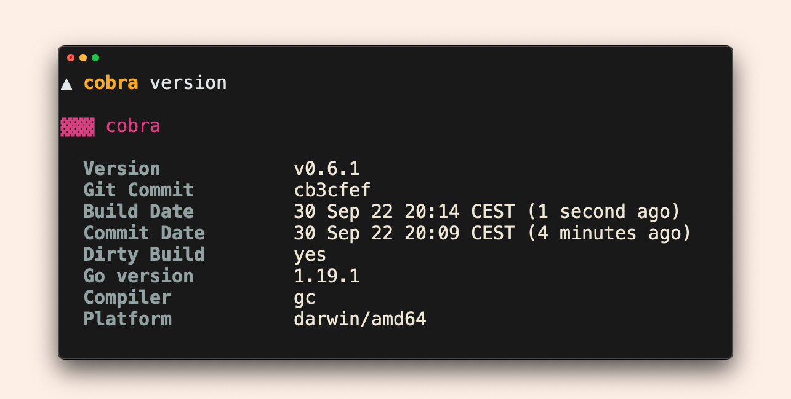
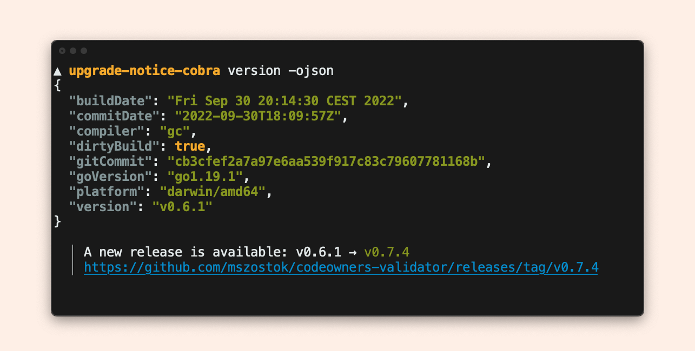
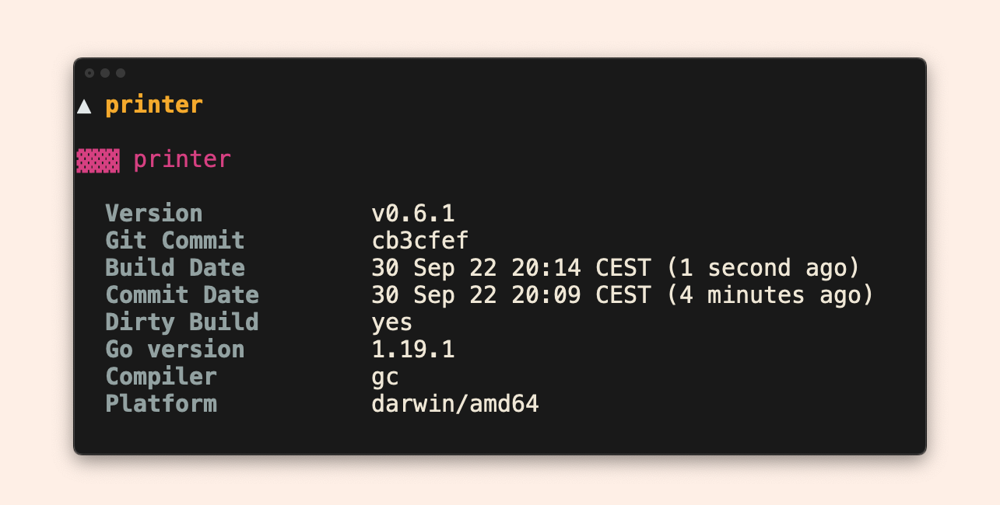
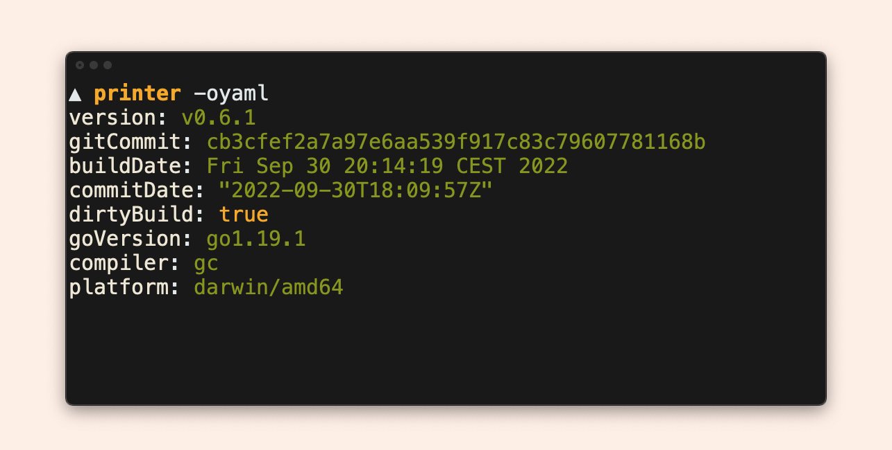

# Runnable examples

???+ example "Prerequisites"

    To play with it:

    1. Clone the repository:
    	 ```bash
    	 gh repo clone mszostok/version
    	 ```
    2. Navigate to [`example`](https://github.com/mszostok/version/tree/main/examples) directory.
    3. Run a given example.


## [Cobra](https://github.com/mszostok/version/tree/main/examples/cobra/main.go)




!!! run-example "Run in terminal"
    ```bash
    # Build
    go build -ldflags "-X 'go.szostok.io/version.buildDate=`date`'" -o example ./cobra

    # Showcase
    ./example version -h
    ./example version
    ```

## [Cobra Upgrade Notice](https://github.com/mszostok/version/tree/main/examples/upgrade-notice-cobra/main.go)




!!! run-example "Run in terminal"
    ```bash
    # Build
    go build -ldflags "-X 'go.szostok.io/version.version=0.6.0'" -o example ./upgrade-notice

    # Showcase
    ./example version
    ./example version -ojson
    ```

## [Custom Upgrade Notice](https://github.com/mszostok/version/tree/main/examples/upgrade-notice-custom/main.go)


!!! run-example "Run in terminal"
    ```bash
    # Build
    go build -ldflags "-X 'go.szostok.io/version.version=0.6.0'" -o example ./upgrade-notice-custom

    # Showcase
    ./example version
    ```

## [Upgrade Notice sub-command](https://github.com/mszostok/version/tree/main/examples/upgrade-notice-sub-cmd)


!!! run-example "Run in terminal"
    ```bash
    # Build
    go build -ldflags "-X 'go.szostok.io/version.version=0.6.0'" -o example ./upgrade-notice-sub-cmd

    # Showcase
    ./example version check
    ```

## [Printer](https://github.com/mszostok/version/tree/main/examples/printer/main.go)





!!! run-example "Run in terminal"
    ```bash
    # Build
    go build -ldflags "-X 'go.szostok.io/version.buildDate=`date`'" -o example ./printer

    # Showcase
    ./example
    ./example -oyaml
    ./example version -oshort
    ```

## [Printer Post Hook](https://github.com/mszostok/version/tree/main/examples/printer-post-hook/main.go)


!!! run-example "Run in terminal"
    ```bash
    # Build
    go build -ldflags "-X 'go.szostok.io/version.version=0.6.0'" -o example ./printer-post-hook

    # Showcase
    ./example
    ```

## [Plain](https://github.com/mszostok/version/tree/main/examples/plain/main.go)


!!! run-example "Run in terminal"

    ```bash
    # Build
    go build  -ldflags "-X 'go.szostok.io/version.buildDate=`date`'" -o example ./plain

    # Showcase
    ./example
    ```

## [Custom Formatting](https://github.com/mszostok/version/tree/main/examples/custom-formatting/main.go)


!!! run-example "Run in terminal"
    ```bash
    # Build
    go build -ldflags "-X 'go.szostok.io/version.buildDate=`date`'" -o example ./custom-formatting

    # Showcase
    ./example
    ```

## [Custom Layout](https://github.com/mszostok/version/tree/main/examples/custom-layout/main.go)


!!! run-example "Run in terminal"
    ```bash
    # Build
    go build -ldflags "-X 'go.szostok.io/version.buildDate=`date`'" -o example ./custom-layout

    # Showcase
    ./example
    ```

## [Custom Renderer](https://github.com/mszostok/version/tree/main/examples/custom-renderer/main.go)


!!! run-example "Run in terminal"
    ```bash
    # Build
    go build -ldflags "-X 'go.szostok.io/version.buildDate=`date`'" -o example ./custom-renderer

    # Showcase
    ./example
    ```
