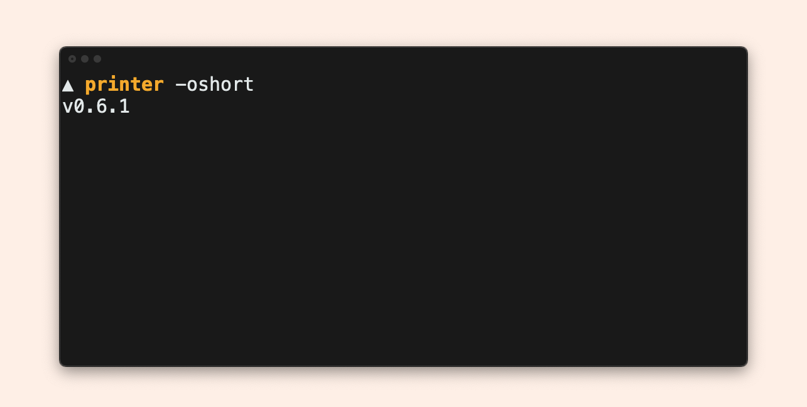

# Runnable examples

???+ example "Prerequisites"

    To play with it:

    1. Clone the repository:
    	 ```bash
    	 gh repo clone mszostok/version
    	 ```
    2. Navigate to [`example`](https://github.com/mszostok/version/tree/main/example) directory.
    3. Run a given example.


## [Plain](https://github.com/mszostok/version/tree/main/example/plain/main.go)


```bash
# Build
go build  -ldflags "-X 'github.com/mszostok/version.buildDate=`date`'" -o example ./plain

# Showcase
./example
```

## [Cobra](https://github.com/mszostok/version/tree/main/example/cobra/main.go)


```bash
# Build
go build -ldflags "-X 'github.com/mszostok/version.buildDate=`date`'" -o example ./cobra

# Showcase
./example version -h
./example version
```

## [Printer](https://github.com/mszostok/version/tree/main/example/printer/main.go)




```bash
# Build
go build -ldflags "-X 'github.com/mszostok/version.buildDate=`date`'" -o example ./printer

# Showcase
./example
./example -oyaml
./example version -oshort
```
