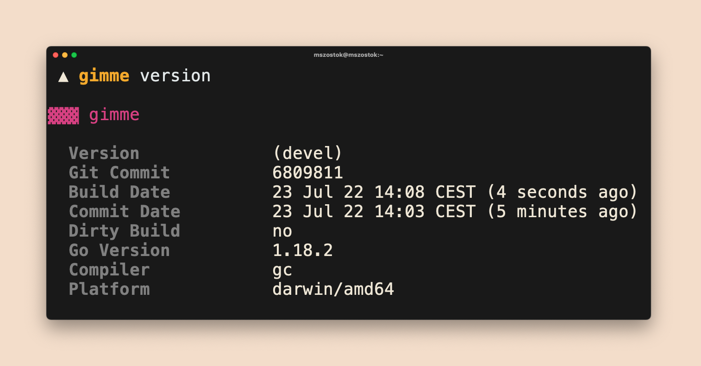

<br />

```go
import "go.szostok.io/version"
```

Importable Go package to present your CLI version in a classy way. All magic included!



Like the idea? [Give a GitHub star](https://github.com/mszostok/version) ⭐!

# 

## Installation

```bash
go get go.szostok.io/version
```

## Functionality

- For Go 1.18+ detect `version`, `commit`, `commitDate`, `dirtyBuild` automatically
  - Allow to override the data via `-ldflags`
- Print version in YAML, JSON, short and pretty formats
- Parse any date strings
- Print date in the local time
- Autodiscover installation method
- Display an upgrade notice if a newer version was released
- Highly customizable pretty output format
- No `init()` function usage inside this package

<br />


### `pretty` format

There are two different built-in styles. However, you can easily create your own. You can customize formatting or layout only or do both.
<br /><br />


### `json` format

JSON format can be useful for scripting purposes, e.g.

```
<cli> version -ojson | jq .gitCommit
```

<br /><br />


### `yaml` format

YAML format can be useful for scripting purposes, e.g.

```
<cli> version -oyaml | yq .gitCommit
```

<br /><br />


### `short` format

Short format can be useful for CI purposes to easily validate that the correct version is used.
<br /><br />

##  Staying Informed

Follow the [@mszostok](https://twitter.com/m_szostok) on Twitter to get the latest news. You can also subscribe for new [`version`](https://github.com/mszostok/version/releases) releases on GitHub. I post there a detailed changelog for every release.

For more additional content check the [Mateusz's Szostok blog](https://szostok.io).
