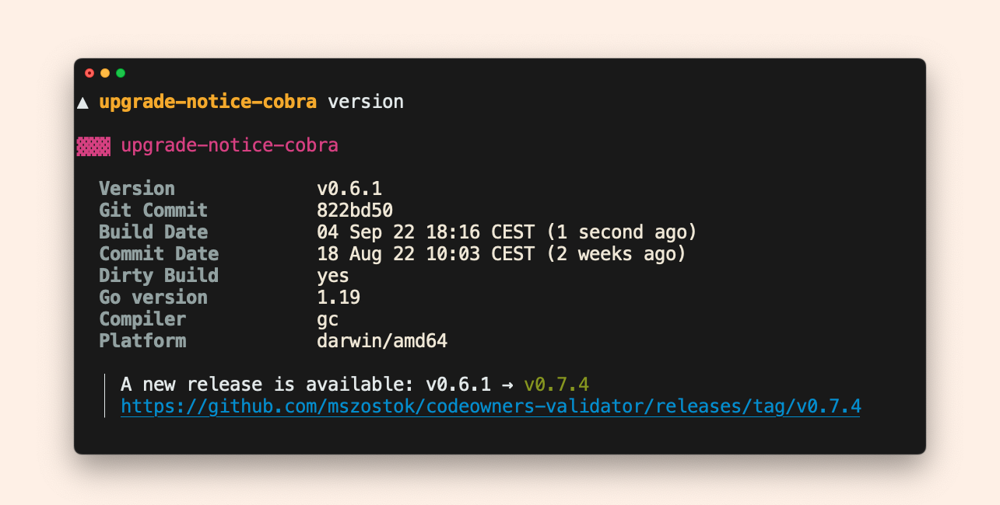
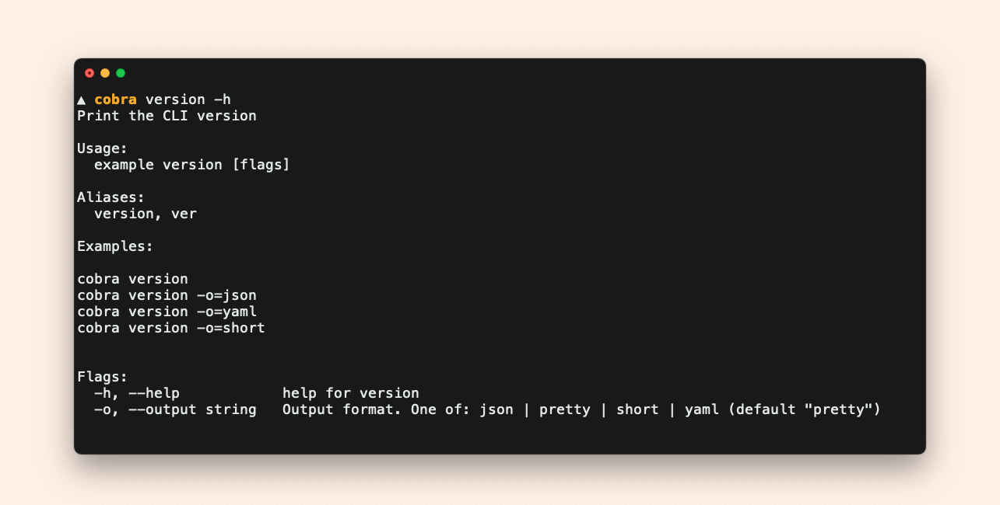

# Quick Start

The quick start guide describes how to set up `version` with the most common way of creating CLIs in Go. It uses [Cobra](https://cobra.dev/) and [GoReleaser](https://goreleaser.com/).

## Register the `version` command

```go linenums="1" hl_lines="19-23"
package main

import (
	"os"

	"github.com/spf13/cobra"

	"go.szostok.io/version/extension"
)

// NewRoot returns a root cobra.Command for the whole CLI
func NewRoot() *cobra.Command {
	cmd := &cobra.Command{
		Use:   "example",
		Short: "An example CLI built with github.com/spf13/cobra",
	}

	cmd.AddCommand(
		// 1. Register the 'version' command
		extension.NewVersionCobraCmd(
			// 2. Explicitly enable upgrade notice
			extension.WithUpgradeNotice("repo-owner", "repo-name"),
		),
	)

	return cmd
}

func main() {
	if err := NewRoot().Execute(); err != nil {
		os.Exit(1)
	}
}
```

This way you get a fully working `<cli> version` command.




## GoReleaser versioning info with `-ldflags`

```yaml
# .goreleaser.yaml
builds:
  - # .. your settings ..

    ldflags:
      - -s -w
      - -X go.szostok.io/version.version={{.Version}}
      - -X go.szostok.io/version.buildDate={{.Date}}
```

### Summary

As you saw, in the blink of an eye, you got a powerful `version` command! However, this only scratches the surfaces of possible configuration options.

You can easily customize the `version` command and adjust it to give you exactly what you need.
For more details, see the documentation:

- [Usage examples](../get-started/usage)
- [Build options](../get-started/build-ldflags)
- [Upgrade notice options](../get-started/upgrade-notice)
- [General Customization](../customization/)
